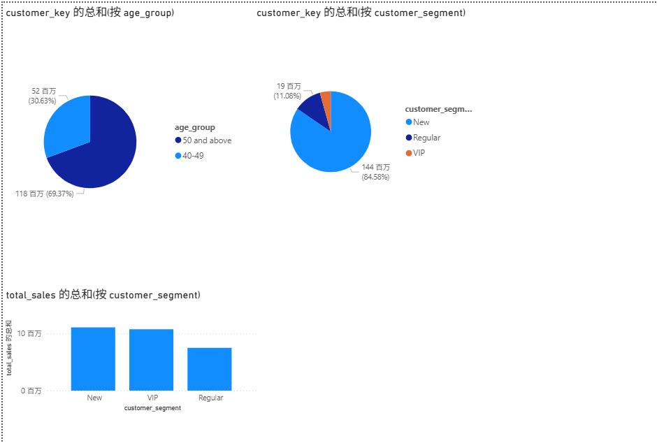
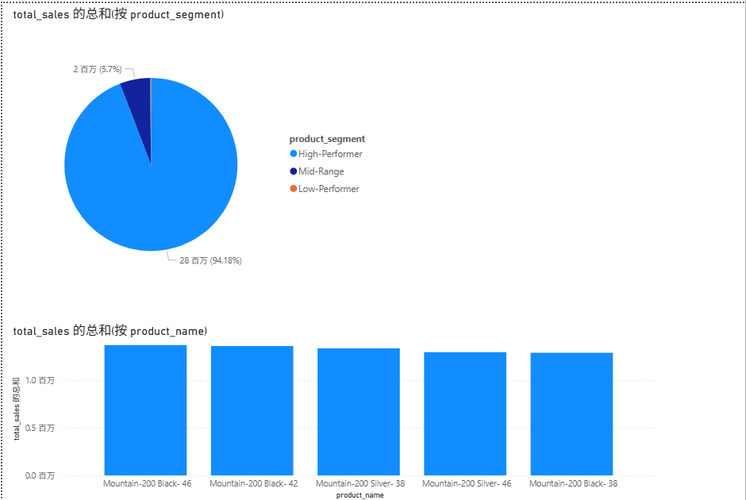

这是我学习SQL数据分析的实战项目，进行了二次优化与注释。

## 项目说明
本项目 Fork 自 DataWithBaraa/sql-data-analytics-project
在原项目基础上我做了以下个人优化：
- 为部分 SQL 文件添加了中文注释
- 在 12/13 文件中新增了客户/产品段分析查询
- 基于数据结果制作了 Power BI 可视化报告
- 对数据结果进行了业务解读和战略建议

# sql-data-analytics-project
A comprehensive collection of SQL scripts for data exploration, analytics, and reporting. These scripts cover various analyses such as database exploration, measures and metrics, time-based trends, cumulative analytics, segmentation, and more.
This repository contains SQL queries designed to help data analysts and BI professionals quickly explore, segment, and analyze data within a relational database. Each script focuses on a specific analytical theme and demonstrates best practices for SQL queries.

补充的内容

1.report_customers 添加不同客户等级的年龄结构

2.report customers 添加饼图分析

3.report products 添加饼图分析

结果解读：
核心客户是 40岁以上的中老年群体，大量客户只购买一次（新客户占近八成），客户留存和复购是最大的业务挑战。
产品方面 Mountain-200 系列撑起销售主力，值得重点维护。

未来战略：
针对选品:1.清理低绩效产品；2.提升配件和服装的连带销售，购买自行车时推荐搭配骑行服与头盔
针对客户:1.开拓年轻客户，0个30岁以下客户，利用小红书、抖音等新媒体营销